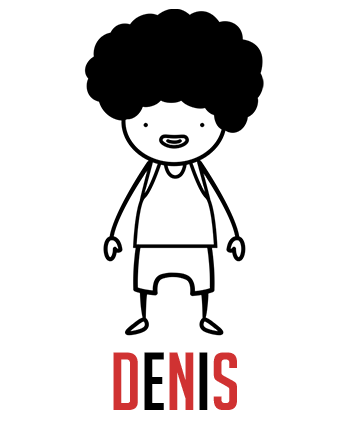

[](https://badge.fury.io/js/denis-bot)

## Introduction

Denis is a Slack bot. He can respond to commands and manage DNS zones, capable of things like adding A or CNAME records.

It was created as the solution to a development team having to keep track of numerous IP addresses for development APIs and servers, so we wanted a way to quickly point subdomains at them. It's still very basic at the moment, but Denis is a good kid and is eager to learn new tricks from your pull requests.

## Installation

1. `npm install denis-bot`

2. Create a Bot integration in Slack

3. Copy the Slack token and add it to `config/config.json` under `slack.apiKey`, or pass it as `SLACK_API_TOKEN` environment variable

4. Configure your provider in `config/config.json`

5. Launch Denis with `npm start`

6. Done. Be cool with Denis!

## Usage

Denis reponds to commands that begin with a mention to his username. In the examples we'll use `denis` as his username, but it'll work with whatever username you set for your bot. He currently knows only two things:

### 1. Querying a record

*Command:*

```
@denis: what is my-site.domain.com?
```

*Response:*

```
I can tell you that my-site.domain.com is a A record pointing to 1.2.3.4.
```

### 2. Adding a record

*Command:*

```
@denis: redirect my-new-site.domain.com to 2.3.4.5
```

*Response:*

```
:tada: Done! I've created a A record pointing my-new-site.domain.com to 2.3.4.5.
```

It detects whether the value you're pointing to is an IP address or another domain, and based on that creates either an A or a CNAME record respectively.

## Providers

Denis was built to support multiple DNS providers. Currently, only CloudFlare is supported, but you can add your own provider by creating a class for it under `providers/` — if you do, please make sure you contribute back and send a PR!

---

© 2016 [Eduardo Bouças](https://eduardoboucas.com). Logo by Erik Kazuo Takara
